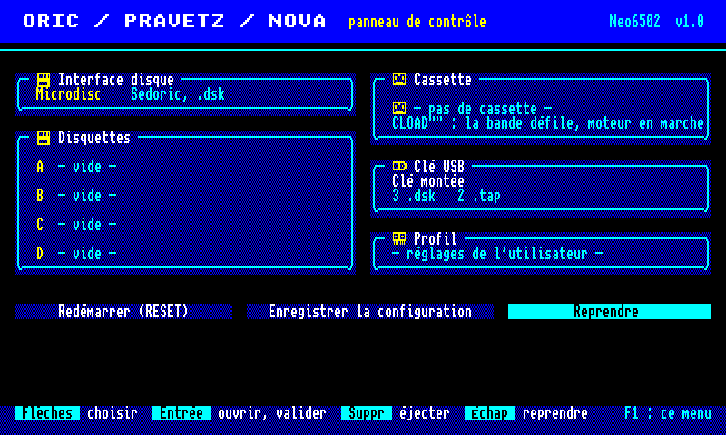
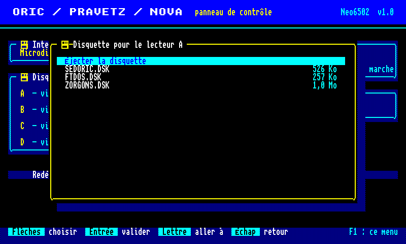
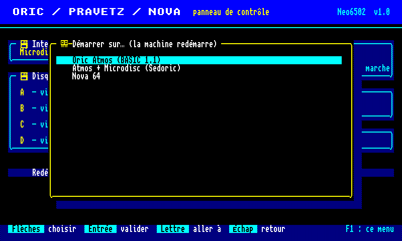

# Oric : disquettes Microdisc / Jasmin et cassettes `.tap`

État au 2026-09-30. Marquage des faits : **[C]** vérifié dans le code d'une
référence (Oricutron `~/oricutron`, Phosphoric `~/Oric1`) ou dans un fichier réel,
**[M]** mesuré sur l'émulateur, **[I]** non vérifié.

## Ce qui est pris en charge

| Support | Format | Interface | Validé par |
|---|---|---|---|
| Disquette | MFM_DISK `.dsk` (géométrie 1) | Microdisc (Sedoric) | Sedoric 1.0, 3.0 et 4.0 démarrent, `DIR` liste le catalogue, *3D Fongus* affiche son écran titre [M] |
| Disquette | MFM_DISK `.dsk` | Jasmin (FT-DOS) | FT-DOS démarre (« BOOTING.. TDOS », BASIC utilisable, gestionnaire `!` installé) ; commandes FT-DOS **non validées** (voir limites) [M] |
| Disquette | NIB (Disk II) | Pravetz 8D | inchangé |
| Cassette | `.tap` | lecteur de cassette | `CLOAD""` d'un programme BASIC et de 8 000 octets à `$A000` [M] |
| Cassette | WAVE (`tools/tap2wave`) | lecteur de cassette | inchangé (ne charge pas avec la ROM 1.1, voir limites) |

## Utilisation (PC)

```bash
./systems/oric/oric disk=Sedoric.dsk             # interface choisie d'après la disquette
./systems/oric/oric fdc=jasmin disk=FTDOS.dsk    # interface forcée : none, pravetz, microdisc, jasmin
./systems/oric/oric disk=a.dsk disk1=b.dsk write=true   # lecteurs 0 et 1, disquettes réécrites à la sortie
./systems/oric/oric tape=jeu.tap                  # CLOAD"" tapé automatiquement, lecture 16x plus rapide
./systems/oric/oric tape=jeu.tap tape-turbo=false
```

Un `.dsk` ou un `.tap` peut aussi être déposé sur la fenêtre. Choix de l'interface
d'après le secteur 1 de la piste 0 : les secteurs d'amorçage FT-DOS (deux signatures,
celles d'Oricutron `machine.c`) donnent le Jasmin, tout le reste le Microdisc [C].

ROM : `src/roms/oric_microdisc_rom.h` (EPROM 8 Ko, MD5 de la version testée
`df864344d2a2091c3f952bd1c5ce1707`) et `src/roms/oric_jasmin_rom.h` (2 Ko,
`5136f764a7dbd1352519351fbb53a9f3`), produites par `tools/bin2hdr`, jamais dans le
dépôt. Sans elles, l'interface correspondante est indisponible.

## Panneau de contrôle et clé USB (RP2040)



**F1** ouvre le panneau (l'émulation est en pause), sur le modèle du menu du
Telestrat (projet Neo6502TeleStrat : même police, même surface de cellules 8 × 8,
même ergonomie) :

- **Interface disque** : aucune, Pravetz 8D, Microdisc, Jasmin (une ROM absente
  est signalée) ; le choix redémarre l'Oric ;
- **Disquettes A à D** (Microdisc et Jasmin) : sélecteur des `.dsk` de la racine de
  la clé ; une image n'est que dans un lecteur à la fois ; lue et écrite en flux
  (une piste de 6 400 octets en mémoire, réécrite quand une autre piste est lue) ;
  un fichier en lecture seule donne une disquette protégée ;
- **Cassette** : sélecteur des `.tap` (la même cassette : rembobinée), position et
  moteur affichés ; lue en flux ;
- **Redémarrer**, **Enregistrer la configuration** (`ORIC.CFG`), **Reprendre** (Échap).

Touches : flèches, Entrée, Suppr (éjecter), Échap, Page préc./suiv., Début/Fin,
une lettre saute au fichier suivant qui commence par elle. F2 à F9 insèrent les
images intégrées au firmware (F1 à F8 auparavant).

`ORIC.CFG` (racine de la clé, une clé par ligne) : `fdc=aucune|pravetz|microdisc|jasmin`,
`a=` … `d=` (lecteurs), `tape=` ; appliqué au montage de la clé (l'Oric redémarre
alors sur la disquette du lecteur A) ; le menu réécrit ces lignes et garde les autres.



### Profils



Comme au Telestrat, un **profil** regroupe une machine et ses supports ;
l'entrée « Profil » du panneau ouvre la page « Démarrer sur… » (le profil
appliqué est marqué, l'Oric redémarre) :

- **intégrés** : Oric Atmos (BASIC 1.1), Atmos + Microdisc (Sedoric), Atmos +
  Jasmin (FT-DOS), Pravetz 8D (Disk II) ; un profil dont la ROM d'interface
  manque n'est pas proposé ;
- **de la clé** (trois au plus), dans `ORIC.CFG` :
  `profil=Libellé;fdc=…;rom=…;a=…;b=…;c=…;d=…;tape=…`. `rom=` charge une ROM
  BASIC de 16 Ko depuis la clé : BASIC 1.0 de l'Oric-1, ROM d'origine du Nova 64…
  (aucune ROM n'est ajoutée au firmware) ; les lecteurs et la cassette non cités
  sont vidés.

```
profil=Oric-1;rom=BASIC10.ROM
profil=Nova 64;rom=NOVA64.ROM;fdc=microdisc;a=SEDORIC.DSK
demarrage=choix
```

`demarrage=choix` ouvre la page « Démarrer sur… » dès le montage de la clé ;
`demarrage=Libellé` (ou `atmos`, `microdisc`, `jasmin`, `pravetz`) applique
directement un profil. Le Nova 64 est un clone yougoslave sous licence de
l'Oric Atmos (Avtotehna, Ljubljana) : il se traite comme un Atmos, avec sa ROM
d'origine sur la clé si on la veut.

Essai sur la carte : page « Démarrer sur… » (4 profils intégrés), passage au
profil « Atmos + Jasmin », profil affiché. Les profils de la clé et `rom=` sont
couverts par les tests (`tests/oric/test_oric_menu.c`), pas encore essayés sur la
carte.

Code : `src/osd/osd.h` (surface, rendu en indices de palette et en plans de 1 bit,
grille 100 × 30 sur le Neo6502 en 800 × 480, 120 × 34 en 960 × 544),
`src/osd/osd_font.h` (police du Telestrat : unscii-8 de Viznut, domaine public, et
icônes du projet), `src/osd/oric_menu.h` (menu, indépendant de la plate-forme),
`src/osd/oric_config.h` (`ORIC.CFG`), `platforms/rp2040/systems/oric/src/oric.c`
(clé USB, flux, rendu par le cœur 1).

### Essai sur la carte (Neo6502, 2026-09-30)

Validé par l'utilisateur à l'écran et par la sonde SWD (`tools/oric_carte.py`) :
panneau net et stable, messages visibles, choix de l'interface (Microdisc et Jasmin
disponibles), disquette de la clé insérée en flux et lue par l'EPROM Microdisc
(`STRATSED.DSK` : « No operating system on disc », réponse attendue pour une
disquette Telestrat), cassette `AIGLE.TAP` insérée et `CLOAD""` lancé (l'Oric est
passé en HIRES ; résultat du jeu non vérifié). Mesures du cœur 1 : 16,8 ms par
image (60 Hz), 44 µs par ligne au plus pour l'image Oric, 55 µs pour le panneau
(budget ≈ 69 µs).

Trois corrections sont venues de cet essai :

- **Lignes du panneau** : PicoDVI répète chaque tampon deux fois
  (`DVI_VERTICAL_REPEAT = 2`) ; le panneau en envoyait deux par ligne, soit deux
  trames par image (image déformée).
- **Encodage vidéo en plans** : l'encodeur à palette pleine résolution de PicoDVI
  (sans équilibrage DC par défaut) donnait des traits rouges sur les grandes zones
  bleues, panneau comme `PAPER 4` du BASIC, avec l'écran de l'utilisateur. L'Oric
  encode désormais trois plans de 1 bit avec `tmds_encode_1bpp`, comme le Telestrat
  et le BBC (`src/systems/oric_planes.h`, reprise de `telestrat_video.h`) ; les
  fonds du panneau sont pleins sur le RP2040 (`OSD_NO_DITHER`).
- **Double tampon** : le cœur 0 dessine le panneau dans une surface cachée puis
  l'échange ; sans lui, le cœur 1 affichait des surfaces à moitié redessinées
  (à-coups, message invisible).

## Matériel émulé

### WD1793 (`src/devices/wd1793.h`)

Écrit d'après la fiche technique WD179x ; les comportements qu'elle laisse ouverts
suivent Oricutron (`disk.c`) et Phosphoric (`src/storage/disk.c`) [C] :

- transferts cadencés par le CPU : le DRQ suivant arrive 32 µs après la lecture ou
  l'écriture du registre de données (pas de perte de données) ;
- commandes de type I terminées en 20 µs, statut « tête chargée » + « index » ;
- « not ready » (bit 7) levé pendant les commandes de types II et III : FT-DOS
  attend un statut ≥ `$81` après le lancement d'une lecture ;
- lecture multi-secteurs arrêtée sans erreur en fin de piste ; interruption forcée
  (`$Dx`) : toujours INTRQ ;
- la recherche de secteur compare le registre de piste au champ ID (fiche technique),
  le côté si le drapeau C est mis ;
- écriture de piste (formatage) avec les octets de contrôle F5 / F6 / F7 ;
- non émulés : vérification des CRC de l'image, temps de rotation et de déplacement.

### Images MFM_DISK (`src/devices/oric_dsk.h`)

En-tête de 256 octets (« MFM_DISK », faces, pistes, géométrie), puis des pistes de
6 400 octets, **face 0 d'abord puis face 1** (géométrie 1, vérifié sur des images à
deux faces, où le champ ID de la piste 0 face 1 porte bien le côté 1) [C]. Certaines
images sont plus courtes que leur en-tête (ex. `arcade1j.dsk` : 2 faces annoncées, une
seule présente) : les pistes absentes se lisent comme non formatées. Accès en mémoire
(PC) ou en flux avec une piste en cache (clé USB, prévu pour le RP2040).

### Microdisc (`src/systems/oric.h`)

`$0310-$0313` WD1793 ; `$0314` écriture : bit 0 INTRQ → IRQ, bit 1 = 0 ROM BASIC
masquée, bit 4 côté, bits 5-6 lecteur, bit 7 = 0 EPROM à `$E000-$FFFF` ; `$0314`
lecture bit 7 = /INTRQ ; `$0318` lecture bit 7 = /DRQ ; autres adresses de la page 3
→ VIA (Oricutron `disk.c`, `machine.c`) [C]. Écritures en `$C000-$FFFF` ignorées quand
une ROM y est visible (Oricutron) [C].

### Jasmin

`$03F4-$03F7` WD1793, `$03F8` côté, `$03F9` remise à zéro (ignorée comme dans
Oricutron), `$03FA` RAM de recouvrement, `$03FB` ROM BASIC masquée + ROM Jasmin en
`$F800-$FFFF`, `$03FC-$03FF` choix du lecteur ; DRQ → IRQ [C]. Démarrage : BASIC
démarre, puis le bouton BOOT est simulé (ROM masquée + reset CPU et VIA) quand la ROM
1.1 atteint `$EB78` (même adresse qu'Oricutron), atteinte après 2,46 s [M]. Sans
information de cycle d'opcode (65C02 réel du Neo6502), le bouton est simulé après
3,5 s (`ORIC_JASMIN_BOOT_TICKS`).

### Cassette `.tap` (`src/devices/oric_td.h`)

Signal d'Oricutron (`tape.c`, `tape.h`) [C], en unités de 208 µs : bit 1 = 208 µs
haut + 208 µs bas, bit 0 = 416 + 416 ; octet de 14 bits (1, départ 0, 8 bits de
données, parité, 1, 1, 1). Au démarrage du moteur sur une amorce, 80 octets `$16` de
plus, puis une pause de 6 unités après l'en-tête et le nom. La ROM mesure l'intervalle
entre deux fronts montants de CB1 avec le timer 2 (seuil `$FE` sur T2C-H, routine
`$E71C` de la ROM 1.1) [C] : 413 cycles donnent un 1, 836 un 0 [M].

Règles propres à reload :

- quand le moteur s'arrête avant la fin du fichier en cours, la bande revient à sa
  position de démarrage du moteur (l'utilisateur n'a pas encore « appuyé sur PLAY ») ;
- un dernier fichier plus court que ce qu'annonce son en-tête (adresse de fin comptée
  exclusive par certains outils, ex. `spell.tap`) est complété par des `$00` ;
- 4 bits à 1 suivent le dernier octet ;
- `.tap` lu en mémoire ou en flux (tampon de 256 octets).

## Corrections apportées au passage

- **RAM à la mise sous tension** : motif d'Oricutron (dans chaque page de 256 octets,
  128 × `$00` puis 128 × `$FF`) au lieu de zéros. Le chargeur de Sedoric additionne
  la RAM de `$0080` à `$36FF` et ne charge que 4 secteurs au lieu de 60 si la somme est
  nulle [M].
- **VIA 6522** (`src/chips/mos6522via.h`, partagé avec le BBC) : désactiver une source
  par l'IER relâche maintenant l'IRQ (IRQ = IFR ∧ IER, fiche technique). L'IRQ restait
  active après `$7F` → `$030E`, ce qui perdait l'interruption de fin de commande de Sedoric.
- **Timer 1 en monocoup** : pas d'interruption tant que T1C-H n'a pas été écrit
  (Oricutron `via.c`, `t1run`) ; l'EPROM Microdisc démarre avant que BASIC programme T1.
- **Relais du moteur** : PB6 seulement s'il est en sortie (ORB ∧ DDRB, comme
  Oricutron) ; le moteur tournait pendant le démarrage de BASIC (2 s) et la bande
  défilait avant le `CLOAD`.
- **Imprimante** : une imprimante toujours prête acquitte chaque octet (front
  descendant de PB4, accusé sur CA1 40 µs plus tard, comme Oricutron). Sans elle, la
  ROM attendait indéfiniment dès qu'un programme imprimait.
- **Reset** : la cassette reste dans le lecteur et est rembobinée (elle était éjectée).

## Tests

```bash
cd platforms/pc/build && cmake .. && make oric_headless oric_devices_test && ctest -R oric
```

- `tests/oric/test_oric_devices.c` (sans ROM) : en-tête et pistes MFM_DISK, CRC,
  formatage par écriture de piste puis relecture des 102 secteurs, commandes de
  type I, erreurs (secteur absent, piste, côté, protection en écriture, pas de
  disque), multi-secteurs, lecture d'adresse, écriture de secteur et marque effacée,
  mode flux avec réécriture, image tronquée ; signal `.tap` redécodé (amorce, pause,
  règles du moteur, remplissage, flux identique à la mémoire) ; VIA ; registres et
  cartes mémoire Microdisc / Jasmin, détection de l'interface, imprimante, relais.
- `tests/oric/run_integration.sh` (ROM et images réelles, chemins réglables par
  variables d'environnement, SKIP si absentes) : démarrage BASIC, frappe, `LPRINT`,
  cassette immobile au démarrage, `CLOAD` BASIC puis `LIST`, `CLOAD` de 8 000 octets,
  Sedoric 4.0 + `DIR`, détection de l'interface, disquette sans système, *3D Fongus*,
  démarrage FT-DOS.
- `tests/oric/test_oric_menu.c` : rendu de la surface (encre, fond, trame, UTF-8,
  grandes lettres), navigation, sélecteurs, refus d'une image déjà dans un autre
  lecteur ou d'une interface sans ROM, défilement, `ORIC.CFG` (lecture, fusion,
  troncature) ; `oric_menu_test DOSSIER` écrit des aperçus PPM du panneau.
- `platforms/pc/systems/oric/src/oric_headless.c` : lanceur sans fenêtre utilisé par
  ces tests (`-c`, `-0..-3`, `-T`, `-V`, `-t`, `-s`, `-i`, `-P`, `-H`, `-p`, `-r`, `-W`).

## Limites connues

- **FT-DOS** : le système démarre, mais aucune commande n'a pu être validée (`CAT`,
  `!CAT`, `DIR` donnent « ?SYNTAX ERROR ») faute de référence : Phosphoric affiche
  le même écran après le démarrage, et Oricutron n'a pas pu être lancé ici (pas
  d'affichage virtuel, ROM absentes de `~/oricutron/roms`). À comparer avec
  Oricutron sur une vraie session.
- Sous Sedoric, la première touche tapée après le démarrage est perdue, quel que
  soit le délai (pas sous BASIC seul) ; non comparé à une référence.
- Les images WAVE produites par `tools/tap2wave` ne se chargent pas avec la ROM 1.1,
  déjà avant ces changements (vérifié sur la dernière version de l'auteur d'origine,
  `8e2fcff`) : leur bit 0 dure 208 + 416 µs. La lecture directe des `.tap` les remplace.
- La version PC n'a pas le panneau (options de ligne de commande et
  glisser-déposer à la place).
- Démarrage d'une disquette Sedoric ou FT-DOS depuis la clé : pas encore essayé sur
  la carte (la clé d'essai ne contenait qu'une disquette Telestrat).
- Formats non pris en charge : MFM_DISK de géométrie 2, ancien format `ORICDISK`,
  images Sedoric brutes (`SED*`), contrôleur BD-500, Telestrat.
